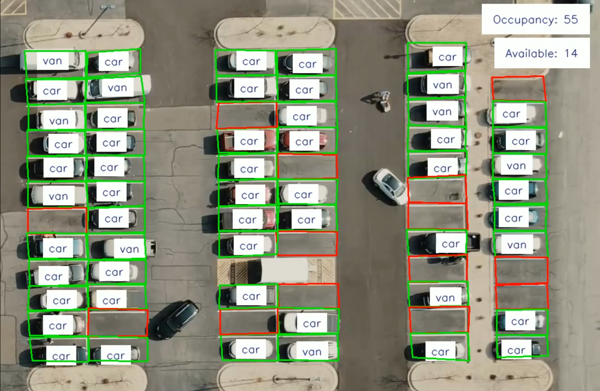

# Parking Management System using YOLOv11

This project implements a parking management system using **YOLOv11** for vehicle detection. It allows you to process parking footage and identify vehicle occupancy using bounding boxes.

## Project Overview

- **Footage:** The project uses video footage from a parking lot (`carPark.mp4`).
- **YOLO Model:** The detection is performed using a pre-trained YOLOv11 model (`yolov11n_-visdrone.pt`).
- **Bounding Boxes:** The bounding box coordinates for the parking spots are stored in the `bounding_boxes.json` file.

## Features

- Detects parking spots and draws bounding boxes for the vehicles.
- Uses **YOLOv11** for vehicle detection.
- Generates an annotated video with bounding boxes around parked vehicles.

## Prerequisites

Ensure you have the following installed:
- Python 3.x
- OpenCV
- ultralytics (YOLOv11 implementation)
- Other dependencies listed in `requirements.txt`

## Installation

1. Clone this repository:
    ```bash
    git clone https://github.com/your-username/Parking_Management_System.git
    cd Parking_Management_System
    ```

2. Install the required dependencies:
    ```bash
    pip install -r requirements.txt
    ```

3. Run the main script:
    ```bash
    python Parking_Management_System.py
    ```

## Directory Structure

- `Parking_Management_System.py`: Main script to process video and manage parking spots.
- `carPark.mp4`: Sample video footage of a parking lot.
- `yolov11n_-visdrone.pt`: Pre-trained YOLOv11 model for vehicle detection.
- `bounding_boxes.json`: JSON file storing the parking spot coordinates.

## How to Use

1. Load the video footage into the system.
2. The script draws bounding boxes on the detected vehicles based on parking spots defined in `bounding_boxes.json`.
3. Output video with bounding boxes is saved as `parking management.avi`.

## Output Video

The output video demonstrating the parking management system in action is available [here on Google Drive](https://drive.google.com/file/d/17npdHbwHzyo4vczljQ3u6rssT6ixFrHT/view?usp=sharing).



In this video, parking spaces are monitored, and vehicle occupancy is detected using YOLOv11.


## License

This project is licensed under the MIT License - see the [LICENSE](LICENSE) file for details.
